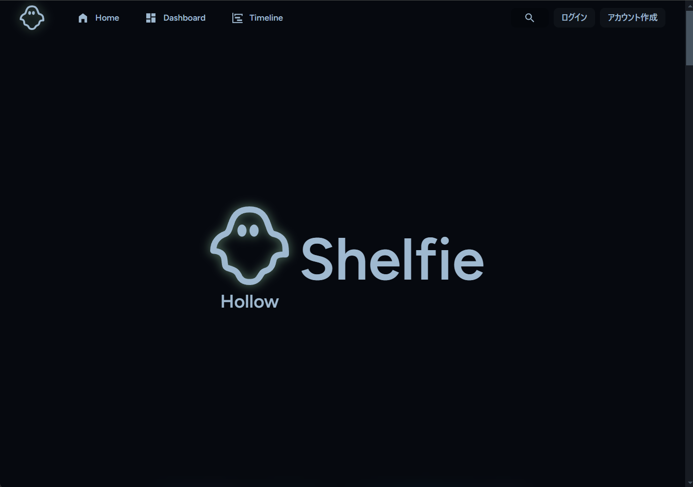
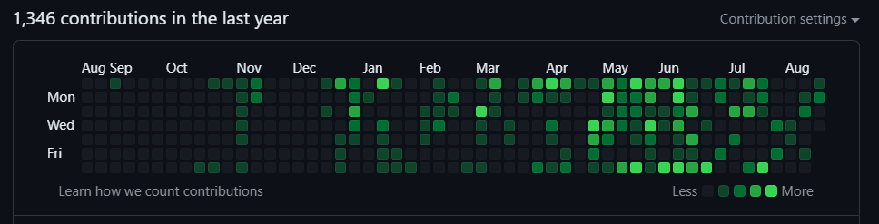
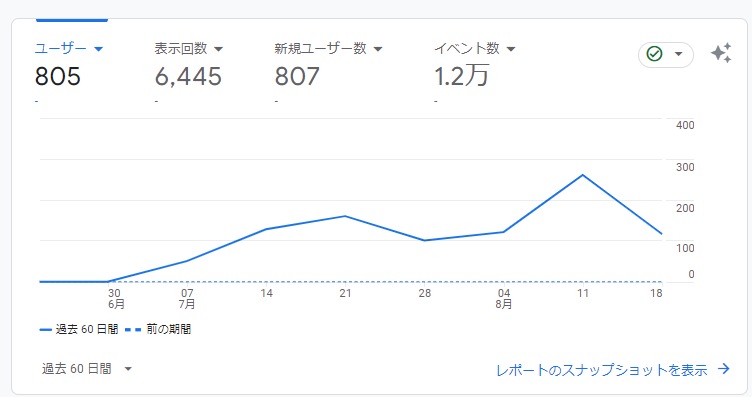
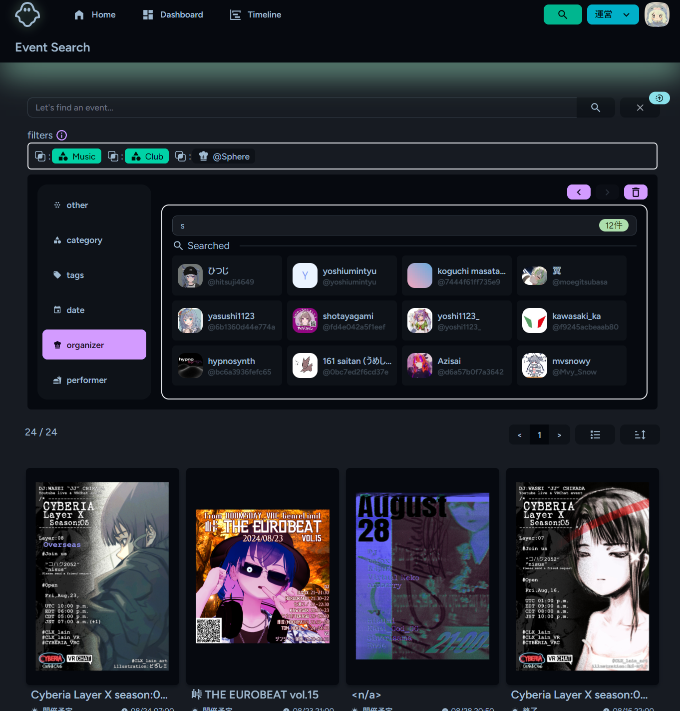

---
# try also 'default' to start simple
theme: seriph
# random image from a curated Unsplash collection by Anthony
# like them? see https://unsplash.com/collections/94734566/slidev
background: https://cover.sli.dev
# apply any unocss classes to the current slide
class: 'text-center'
# https://sli.dev/custom/config-highlighter.html
highlighter: shiki
# some information about the slides, markdown enabled
info: |
  ## Slidev スターターテンプレート
  開発者向けのプレゼンテーションスライド。

  詳細は [Sli.dev](https://sli.dev) をご覧ください
transition: slide-up
title: 個人開発の共有
mdc: true
fonts:
  sans: Robot
  serif: Robot Slab
  mono: Fira Code
  font-size: 30px
---

# 個人開発の共有

2024/08/24 所属会社社内LT会スライド


2024/08/20 @SphereStacking


---
transition: slide-up
---

# 自己紹介

<div class="flex flex-row gap-2 h-full  items-center">
  <div class="w-full">
```
{
"profile" : {
  "name" : "XX XX",
  "handlename" : "Sphere",
  "tolikes" : [
    "🟢(#bbffcc)","🏍️",
  ],
  "dislikes" : [
    "🦐"
  ],
  "career" : [
      { "job":"Web Engineer", "period":"2023/08 ~ now" },
      { "job":"🚀🛰📡 Engineer", "period":"2016/04 ~ 2023/07" }
  ],
}
```
  </div>
  <div class="w-full">
  昨年8月に組み込み系からWEB系に転職

  社会人歴9年目、仕事としてのweb系は1年のエンジニア

  プライム企業の下請けで従事していた

  30年来の熟成されて黒魔術と化したシステムを保守/運用/機能追加しており
  技術スタックが古い企業でエンジニアしていました。
  </div>
</div>

<style>
h1 {
  background-color: #2B90B6;
  background-image: linear-gradient(45deg, #4EC5D4 10%, #146b8c 20%);
  background-size: 100%;
  -webkit-background-clip: text;
  -moz-background-clip: text;
  -webkit-text-fill-color: transparent;
  -moz-text-fill-color: transparent;
}
</style>

---
layout: default
transition: slide-up
---

# 目次

<Toc maxDepth="1"></Toc>

---
transition: slide-left
---

# サービスの概要
 
 <div class="flex justify-center flex-col text-center">
  <p class="text-xl font-bold text-gray-900 p-4 rounded-lg shadow-lg bg-gradient-to-r from-gray-700 to-gray-300">
    <span class="text-3xl font-black text-red-500">
    「ポスター」
    </span>
    と
    <span class="text-3xl font-black text-blue-500">
    「人（主催者、演者）」
    </span>
    <br>
    <p class="text-xl">
      主軸に置いたVR界隈のイベント共有サービス
    </p>
    <div class="aspect-auto h-75">
      
    </div>
  </p>

 </div>
---
transition: slide-left
level: 2
---

# サービスの概要
なにができるのか

<div class="text-xl font-bold text-gray-900 p-4 rounded-lg shadow-lg bg-gradient-to-r from-gray-500 to-gray-300">
  <div class="grid grid-cols-3 gap-2">
    <div>
      <h3 class="text-4xl">イベント</h3>
      <ul>
        <li>掲載 / 編集 / 検索</li>
        <li>SNSへのシェアテキスト生成</li>
        <li>外部calendarへの登録</li>
        <li>タイムライン表示</li>
        <li>いいね / ブックマーク</li>
        <li>フォロー</li>
      </ul>
    </div>
    <div class="">
      <h3 class="text-4xl">ユーザー</h3>
      <ul> 
        <li>プロフィール</li>
        <li>チーム(グループ) 試験運用中</li>
        <li>フォロー</li>
      </ul>
    </div>
    <div class="">
      <h3 class="text-4xl">管理側</h3>
      <ul> 
        <li>コンテンツ管理</li>
        <li>ユーザー管理</li>
        <li>権限とロール管理</li>
        <li>コンフィグ設定管理</li>
      </ul>
    </div>
  </div>
</div>

<p class="text-4xl text-center p-10"  v-click>
  これだけ。
</p>


---
transition: slide-up
---

# 開発の動機
なにを実現したかったのか

<div class="text-xl font-bold text-gray-900 p-4 rounded-lg shadow-lg bg-gradient-to-r from-gray-500 to-gray-300">
  <div class="flex justify-center flex-col mx-20">
    <p class="text-xl">
      フライヤーやポスターをメインとしたEventの共有サイトがなかった。
    </p>
    <p class="text-xl">
      VR界隈をメインターゲットとした共有サイトはあるが見にくいし探しずらい
    </p>
    <p class="text-xl">
      推しタレントの出演情報をとにかく追いにくい。
    </p>
    <p class="text-xl">
      コミュニティが閉じていて外の情報が集めにくい
    </p>
  </div>
</div>
<p class="text-4xl text-center pt-8"  v-click>
  そんなことを解決できる
  <br>
  <br>
  <strong>サービス</strong>があったらいいなと思った。
</p>


---
transition: slide-up
level: 2
---

# 開発の動機
本当の理由?

<div class="text-xl font-bold text-gray-900 p-4 rounded-lg shadow-lg bg-gradient-to-r from-gray-500 to-gray-300">
  <div class="flex justify-center  flex-col mx-20">
    <ol>
      <li>最新の技術に触れるられる機会が減った<br>
        <span class="text-lg">所属会社の主要な技術スタックが。。</span><br>
        <span class="text-lg">勉強する動機を作りたかった。</span>
      </li>
      <li>自分主体で開発できなくなった。<br>
        <span class="text-lg">自分が提案できることが少ない。</span>
      </li>
      <li>開発を始めた当時のタスクが作業感の強く面白味が。。
      </li>
    </ol>
  </div>
</div>
<div class="text-2xl pt-10 text-center" v-click>
  自分のサービスを作ろう!
</div>


---
transition: slide-up
level: 2
---

# 技術スタック
使用したライブラリ等

<div class="grid grid-cols-4 gap-2 w-full  bg-gradient-to-r from-gray-500 to-gray-300 p-4 rounded-lg shadow-lg text-gray-900 text-xl font-bold">

  <div>
    <div class="text-xl">バックエンド</div>
    <ul>
      <li>laravel 10.x</li>
      <li>jetstream</li>
      <li>scout<br>(meilisearch)</li>
      <li>socialite</li>
      <li>filament</li>
    </ul>
  </div>
  <div>
    <div class="text-xl">フロントエンド</div>
    <ul>
      <li>vue 3.x</li>
      <li>tailwindcss 3.x</li>
      <li>DaisyUI 4</li>
      <li>inertiajs</li>
      <li>tiptap</li>
      <li>swiper</li>
    </ul>
  </div>
  <div>
    <div class="text-xl">その他</div>
    <ul>
      <li>laravel forge</li>
      <li>digital ocean</li>
      <li>Cloudflare R2</li>
      <li>mailtrap</li>
      <li>Sentry</li>
      <li>Google Analytics</li>
      <li>Google Api <br>(form, calendar)</li>
      <li>X api</li>
    </ul>
  </div>
</div>

---
transition: slide-up
level: 2
---

# ランニングコスト

<div class="text-xl font-bold text-gray-900 p-4 rounded-lg shadow-lg bg-gradient-to-r from-gray-500 to-gray-300">
  <div class="flex justify-start flex-row items-top w-full">
    <div class="flex flex-col w-1/2 pl-10 justify-left">
      <div class="mb-4" v-click>
        <span class="text-2xl font-semibold">laravel forge</span> <span class="text-lg">$15/month</span>
      </div>
      <div class="mb-4" v-click>
        <span class="text-2xl font-semibold">CodeRabbit</span> <span class="text-lg">$15/month</span>
      </div>
    </div>
    <div class=" h-full flex flex-col justify-end items-end">
      <div class="mb-4" v-click>
        <span class="text-2xl font-semibold">Digital Ocean</span> <span class="text-lg">$12/month</span>
        <ul class="list-disc list-inside ml-4">
          <li>app server</li>
          <li>db server</li>
          <li>meilisearch server</li>
        </ul>
      </div>
    </div>
  </div>
</div>
<div class=" text-center  p-10"  v-click
  v-motion
  :initial="{ x:35, y: 40, opacity: 0}"
  :enter="{ y: 0, opacity: 1, transition: { delay: 0 } }">
  <p>結構かかってる。。</p>
  <openmoji-smiling-face-with-halo class="size-30"/>
</div>


---
transition: slide-up
level: 2
---

# 開発期間
 2023/11 ~ now



<div class="text-center p-10 text-xl grid grid-cols-2 gap2" v-click>
<div>
  <table class="text-xs">
    <tr>
      <td>平日</td>
      <td> 4h </td>
    </tr>
    <tr>
      <td>土日</td>
      <td> 8h </td>
    </tr>
  </table>
</div>
<div>
コード書いてる時間以外の<br>過ごし方を忘れました。
</div>
</div>

---
transition: slide-up
level: 2
---

# ユーザー数の推移

<div class="flex justify-center">
  
</div>
<div class="text-xl flex flex-col justify-center items-center">
  <ul>
    <li>2024/6/9 サービス公開</li>
    <li>2024/7/31 登録ユーザー数100人突破</li>
    <li>2024/8/14 メディア記事に掲載いただいた ( https://metacul-frontier.com/?p=14478 )</li>
  </ul>
</div>

---
transition: slide-up
level: 2
---

# リリースしてからやったこと

<ol>
  <li>ダイレクトマーケティング<br>
    <span class="text-lg">
      主催者への声かけ
    </span>
  </li>
  <li>Xへの定期投稿<br>
    投稿時間 時間の比較
      <ul>
        <li>
          昼 12:00 ~ 13:00 反応多め
        </li>
        <li>
        夜 17:00 ~ 20:00 反応多め
        </li>
      </ul>
      <ul>
        <li>
          夜 21:00 ~ 24:00  とても少ない
        </li>
      </ul>
  </li>
</ol>


---
transition: slide-up
level: 2
---

# 工夫 / こだわり
その1
<div class="flex justify-center flex-row">
  <div class="w-1/2">
  <h3 class="text-2xl">デザイン</h3>
    <div class="text-lg">
      <br>
      メインはポスター<br>
    </div>
  </div>
  <div class="w-90">
      <figure class="w-full ">
        <video controls>
          <source src="./image/こだわり4.mp4" type="video/mp4">
        </video>
        <figcaption class="text-center mt-2 text-sm text-gray-600">
          vue-formを参考
        </figcaption>
      </figure>
  </div>
</div>

---
transition: slide-up
level: 2
---

# 工夫 / こだわり
その2

<div class="flex justify-center flex-row">
  <div class="w-1/2">
    <h3 class="text-2xl">自由度の高い検索フィルター</h3>
    <div class="text-lg mt-3">
      カテゴリ / タグ / 主催者 / 場所 / 主催 / 演者 /  日時 
      <br>
      全てを
      <strong class="text-red-500">AND</strong> x <strong class="text-red-500">OR</strong> x <strong class="text-red-500">NOT</strong>
      で組み合わせることができる。
    </div>
    <h3 class="text-2xl mt-10">検索エンジンの導入</h3>
    <div class="text-lg mt-3">
      meilisearchを使用
      高速な全文検索が可能
      <br>
      laravelのscoutがラップしているが
      リレーションデータの連携や<br>
      フィルター処理は自前実装。
    </div>
  </div>
  
</div>

---
transition: slide-up
level: 2
---

# 工夫 / こだわり
その3

<div class="flex justify-center flex-row">
  <div class="w-1/2">
  <h3 class="text-2xl">UIシステムを使用しない</h3>
    <div class="text-lg">
      使用してもHeadlessのようなもの<br>
      コーディング力を上げること。<br>
      他のPJにも流用可能なデザインシステムを作ること。
    </div>
    <div>
      <figure class="w-full pt-10">
        <video controls>
          <source src="./image/こだわり3.mp4" type="video/mp4">
        </video>
        <figcaption class="text-center mt-2 text-sm text-gray-600">
          ag-gridを参考
        </figcaption>
      </figure>
    </div>
  </div>
  <div class="w-1/2">
      <figure class="w-full pt-10">
        <video controls>
          <source src="./image/こだわり2.mp4" type="video/mp4">
        </video>
        <figcaption class="text-center mt-2 text-sm text-gray-600">
          vue-formを参考
        </figcaption>
      </figure>
  </div>
</div>

---
transition: slide-up
level: 2
---

# 工夫 / こだわり
その4

<div class="flex justify-center flex-row">
  <div class="w-1/2">
    <h3 class="text-2xl">使用用途を限定しない</h3>
    <div class="text-lg">
      できるだけ特定の対象だけのサービスにしないようにしました。
      config系のデータは全てカスタマイズできるようにしており
      <br>
      もし、今のターゲットがダメったとしても  
      他のターゲットでも使えるようにしておき
      サービスを再利用できるようにしておきました。
    </div>
  </div>
</div>

---
transition: slide-up
level: 2
---

# 今後やりたいこと

- 公募機能(主催者と演者のマッチング)
- 多言語対応(基盤は導入済み)
- 決済サービスの導入(課金周り)
  - お金を稼ぎたいというより、決済機能のキャッチアップ。
- 直感的なブックマークした階層的なEventの仕分け機能
- レコメンドエンジンの構築
  - ユーザーのお気に入りやブックマークをもとにしたレコメンド
- プラットフォームの公開APIを使用したサービスとの連携
  - 連携機能はないため工夫が必要
- Google Analyticsの活用

---
transition: slide-up
level: 2
---

# 苦労したこと

- サービス名の変遷について買ったのに使わないdomain 4つも。。。
- seoがよくわかってなくて途中でSSRに変更したこと。
- 419エラーの解消にてこずったこと
- 全文検索(MeiliSearch)でネストした検索に苦労した話。
- 全文検索(MeiliSearch)で日本語検索が全くうまくいかなかった。
- 動的なfilterの生成の話。
- 記事通りlaravelのtz設定したら+9h 時刻がズレた話
- vue-formのスタイルが気に入らなかったからformの構築を自作した話
- tiptapをしようしたwysiwygエディターの構築
- 特定のページだけ502エラーとなってしまう。


---
transition: slide-up
level: 2
---

# 振り替えってみて

<div class="flex justify-center flex-row">
  <
- まぁ全然使ってもらえない。
  - ユーザー投稿型だと過疎ったら終わりなのでハードル高かったかも。。
  - そもそも知ってもらうのが大変

- 所属会社のサービスの展開方法が賢いなと実感  
  - 自社の人員を多く割くことなく、サービスを多くの人に展開できている(B to B to C)
  - リソースに限りのある個人ではリーチに限りがある。

- マーケティングが全くできていなかった。
  - イベントなどに顔を出して主催者へのアプローチをしておけばよかったと思ってます。

- 総じて、とても勉強になった。
  - 一番身についたのは課題にぶつかった時の調べ方だ
  - 公式のドキュメントやGithubのIssueを穴が開くほど眺めたりライブラリの中のソースを読んだりする経験ができました。

</div>

---
layout: center
class: text-center
---

# Thank you
[]

[👻Shelfie](https://hollowshelfie.com/home) / [GitHub](https://github.com/SphereStacking)

---
preload: false
---

# credits
このスライドはSlidevで作成しています。

<div class="grid grid-cols-2 gap-2">
<div>
<div class="w-60 relative mt-6">
  <div class="relative w-40 h-40">
    
    
    
  </div>

  <div
    class="text-5xl absolute top-14 left-40 text-[#2B90B6] -z-1"
    v-motion
    :initial="{ x: -80, opacity: 0}"
    :enter="{ x: 0, opacity: 1, transition: { delay: 2000, duration: 1000 } }">
    Slidev
  </div>
</div>

<!-- vue script setup scripts can be directly used in markdown, and will only affect the current page -->
<script setup lang="ts">
const final = {
  x: 0,
  y: 0,
  rotate: 0,
  scale: 1,
  transition: {
    type: 'spring',
    damping: 10,
    stiffness: 20,
    mass: 2
  }
}
</script>
<div
  v-motion
  :initial="{ x:35, y: 40, opacity: 0}"
  :enter="{ y: 0, opacity: 1, transition: { delay: 2500 } }">
  <Tweet id="1390115482657726468" scale="0.65" />
</div>

</div>
<div>
<div
  v-motion
  :initial="{ x:35, y: 40, opacity: 0}"
  :enter="{ y: 0, opacity: 1, transition: { delay: 2700 } }">

- [slidevjs/slidev](https://github.com/slidevjs/slidev)
</div>
<div
  v-motion
  :initial="{ x:35, y: 40, opacity: 0}"
  :enter="{ y: 0, opacity: 1, transition: { delay: 2900 } }">

- [tangramor/slidev_docker](https://github.com/tangramor/slidev_docker)

</div>
<div
  v-motion
  :initial="{ x:35, y: 40, opacity: 0}"
  :enter="{ y: 0, opacity: 1, transition: { delay: 3100 } }">

markdownでスライドを作成できるツールです。

tailwdincss(cssでも可能)で装飾できて使い勝手良かったです。

下記も使用可能です<br>
Latex / mermaid diagram / vueコンポーネント

</div>

</div>

</div>
