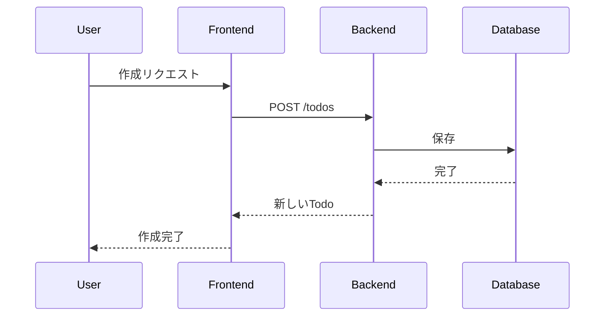
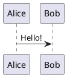

# **Slidev**の布教

所属会社 Tech meet up #1 登壇スライド

<div class="pt-12">
  <span @click="$slidev.nav.next" class="px-2 py-1 rounded cursor-pointer" hover="bg-white bg-opacity-10">
    Press Space for next page <carbon:arrow-right class="inline"/>
  </span>
</div>

<div class="abs-br m-6 flex gap-2">
  <button @click="$slidev.nav.openInEditor()" title="Open in Editor" class="text-xl slidev-icon-btn opacity-50 !border-none !hover:text-white">
    <carbon:edit />
  </button>
  <a href="https://github.com/slidevjs/slidev" target="_blank" alt="GitHub" title="Open in GitHub"
    class="text-xl slidev-icon-btn opacity-50 !border-none !hover:text-white">
    <carbon-logo-github />
  </a>
</div>


---
src: ../../components/slides/profile_2024.md
transition: slide-up
---

---

# **今日の話すこと**

1. 紹介背景
2. Slidevのについて
3. Slidevでできること
4. 簡単なデモをお見せします

---

# **紹介の背景と目的**

## **背景**
  - プレゼンやLTを行う際、スライド作成に意外と時間がかかることってありませんか？  
  - GoogleスライドやCanvaを使っても、レイアウト調整が思ったより手間に感じませんか？
  - 開発者にとって馴染みのMarkdownを用いてスライドを作成できる。


## **目的**

<div class="flex justify-center flex-col text-center">
  <div class="text-xl font-bold text-gray-900 p-4 rounded-lg shadow-lg bg-gradient-to-r from-gray-700 to-gray-300">
    <div class="text-3xl font-black text-red-700">
    「最近の推しのOSS」
    </div>
    <div class="text-3xl font-black">
      <a href="https://sli.dev/" target="_blank">Slidev</a> の布教
    </div> 
  </div>
</div>


<!-- 今回は、開発者向けのスライド作成に非常に便利なツール、Slidevを紹介します。-->

---

# **Slidevの概要**

- **Slidevとは何か？**  
  - 「Markdownでスライドを作成できるツール」  
  - 「HTMLとCSSを使える」  
  - 「Vueコンポーネントを組み込むことができるため、インタラクティブなスライドも作成可能」  
  - 「発表者用のプレゼンターモードの搭載」
  - 「プレゼンターと連携したスライドの視聴モードも存在」
  - 「一般公開された多様なテーマが利用でき、簡単にデザインを変更できる」

<div class="grid grid-cols-2 mt-12">
  <div>

  - **開発者紹介**:  
    - 「開発者はVue.jsのコアメンバー[Anthony Fu](https://github.com/antfu)さん」  
    - 「Nuxt、VueUse、Iconfy、その他Vue関連」

  </div>
  <div class="flex justify-center">
    
  </div>
</div>

---

# **Slidevの基本機能**

- **スライド作成が簡単**:  
  - **Markdownでスライド作成**するため、コードを書くようにスライドを作成できます。
  - **CSSでスタイリングが可能**で、何度も位置調整する手間がなく、細かいデザインが可能です。<br>(cssなので人によるかもしれない。。。)

- **リアルタイムプレビューで作業効率UP**:  
  - リアルタイムプレビュー機能があり、スライドの編集を行いながら、その結果をすぐに確認できます。

- **プレゼンターモード**:  
  - 発表者がスムーズに進行できるように、**プレゼンターモード**を提供しています。
  - よくあるプレゼンターのみが参照するコメントも可能です。

- **豊富なテーマとカスタマイズ性**:  
  - **公開されたテーマ**を簡単に使用できます。テーマを選ぶだけで、デザイン性の高いスライドを作成できます。

---
layout: two-cols-header
---

# **Markdown**でスライドを作成する

::left::

# h1

# h1
## h2
### h3
#### h4
##### h5
###### h6

::right::

```markdown
# h1

## h2

### h3

#### h4

##### h5

###### h6
```

---
layout: two-cols-header
---

# **Markdown**でスライドを作成する

::left::

- リスト1
- リスト2
- リスト3

1. 番号リスト1
2. 番号リスト2
3. 番号リスト3

~~取り消し線~~


> 引用

[リンクテキスト](https://example.com)

```ts
// コードブロック
console.log('Hello, World!')
```

::right::
```markdown

- リスト1
- リスト2
- リスト3

1. 番号リスト1
2. 番号リスト2
3. 番号リスト3

~~取り消し線~~

> 引用

[リンクテキスト](https://example.com)


```

---
layout: two-cols-header
---

# **layout**

スライドを構成する要素を変更することができます。

::left::

|layout|説明|
|---|---|
|**center**|中央に配置する|
|**cover**|プレゼンテーションの表紙を表示する|
|**default**|デフォルトのレイアウト|
|**end**|プレゼンテーションの終了を示すために使用される|
|**fact**|事実を強調するために使用される|
|**full**|全画面にスライドを表示する|
|**image**|背景画像を設定する|


::right::

|layout|説明|
|---|---|
|**image-left**|左に画像を配置する
|**image-right**|右に画像を配置する|
|**iframe**|iframeを配置する|
|**quote**|引用を配置する|
|**statement**|ステートメントを配置する|
|**two-cols**|2列のスライドを配置する|
|**two-cols-header**|2列のヘッダーを配置する|

---
layout: center
---

# **layout** center

中央に配置することができます。

```markdown
---
layout: center
---
```

---
layout: cover
---

# **layout** cover

プレゼンテーションの表紙を表示するために使用され、プレゼンテーションのタイトルやコンテキストなどが含まれる。

```markdown
---
layout: cover
---
```

---
layout: default
---

# **layout** default

デフォルトのレイアウトです。

```markdown
---
layout: default
---
```

---
layout: end
---

# **layout** end

プレゼンテーションの終了を示すために使用される。

```markdown
---
layout: end
---
```

---
layout: fact
---

# **layout** fact

事実を強調するために使用される。

```markdown
---
layout: fact
---
```

---
layout: full
---

# **layout** full

全画面にスライドを表示する。

```markdown
---
layout: full
---
```

---
layout: image
image: https://cover.sli.dev
---

# **layout** image

スライドごとに背景画像を設定することができます。

<div class="grid grid-cols-2 mt-12">
  <div>

`このスライドは背景画像を設定しています。`

  </div>
  <div>

```markdown
---
layout: image
image: https://cover.sli.dev
---

```

  </div>
</div>


---
layout: image-left
image: https://cover.sli.dev
---

# **layout** image-left

右側に画像を配置しておしゃれにしてみましょう。

```markdown
---
layout: image-left
image: https://cover.sli.dev
---
```

---
layout: image-right
image: https://cover.sli.dev
---

# **layout** image-right

今度は左側に画像を配置しておしゃれにしてみましょう。

```markdown
---
layout: image-right
image: https://cover.sli.dev
---
```

---

# **layout** iframe

iframeを使って、WebPageをスライドとして表示することができます。

```markdown
---
layout: iframe
# the web page source
url: https://sli.dev/
---
```

次のスライドでは、iframeを使って、WebPageをスライドとして表示しています。

---
layout: iframe
# the web page source
url: https://sli.dev/
---

# iframe

---
layout: quote
---

# **layout** quote

引用を配置することができます。

```markdown
---
layout: quote
---
```


---
layout: section
---

# **layout** section

セクションを配置することができます。

```markdown
---
layout: section
---
```

---
layout: statement
---

# **layout** statement

ステートメントを配置することができます。

```markdown
---
layout: statement
---
```

---
layout: two-cols
---

# Left

左側に表示されます

# **layout** two-cols

::right::

# Right

右側に表示されます

```markdown
---
layout: two-cols
---
```


---
layout: two-cols-header
---

# **layout** two-cols-header

両方に表示されます

```markdown
---
layout: two-cols-header
---
```

::left::

# Left

左側に表示されます

::right::

# Right

右側に表示されます

---
layout: two-cols
---

# モナコEditorでのコード表示

::right::

```ts {monaco}

import { ref } from 'vue'
import { useMouse } from '@vueuse/core'

const counter = ref(0)

```

---

# 数式の表示

KaTeXを搭載した LaTeX を使用して数式を表示することができます。
詳細は[Katex](https://katex.org)を参照してください。

<div class="grid grid-cols-2">
  <div>
    $\sqrt{3x-1}+(1+x)^2$
  </div>
  <div>

```
$\sqrt{3x-1}+(1+x)^2$
```

  </div>
</div>

<div class="grid grid-cols-2">
  <div>

$$
\begin{aligned}
\nabla \cdot \vec{E} &= \frac{\rho}{\varepsilon_0} \\
\nabla \cdot \vec{B} &= 0 \\
\nabla \times \vec{E} &= -\frac{\partial\vec{B}}{\partial t} \\
\nabla \times \vec{B} &= \mu_0\vec{J} + \mu_0\varepsilon_0\frac{\partial\vec{E}}{\partial t}
\end{aligned}
$$

  </div>
  <div>

```markdown
$$
\begin{aligned}
\nabla \cdot \vec{E} &= \frac{\rho}{\varepsilon_0} \\
\nabla \cdot \vec{B} &= 0 \\
\nabla \times \vec{E} &= -\frac{\partial\vec{B}}{\partial t} \\
\nabla \times \vec{B} &= \mu_0\vec{J} + \mu_0\varepsilon_0\frac{\partial\vec{E}}{\partial t}
\end{aligned}
$$

```

  </div>
</div>


---
layout: two-cols-header
---


# **図表やグラフ**

Mermaid.jsやPlantUMLを使ってグラフや図表を描画できます。

::left::

## Mermaid


::right::

## PlantUML


---

# スライドのインポート

スライドのインポートも簡単にできます。

```
---
src: ../../components/slides/profile_2024.md
---
```

---

# Styleを変更する

WindiCSS(tailwindCSS互換)を使用して、styleを指定することができます。

<div class="grid grid-cols-2 gap-2">
  <div class="bg-red-500 text-white p-4 rounded-lg shadow-lg">
    <h1 class="text-2xl font-bold">Hello, World!</h1>
    <p class="text-base">This is a custom component.</p>
  </div>

```markdown
<div class="bg-red-500 text-white p-4 rounded-lg shadow-lg">
  <h1 class="text-2xl font-bold">Hello, World!</h1>
  <p class="text-base">This is a custom component.</p>
</div>
```

</div>


---
foo: bar
dragPos:
  square: 401,55,426,_,54
---

# Draggable Elements

ドラッグ可能な要素をダブルクリックして位置を編集できます。

<br>

###### Directive Usage

```md

```

<br>

###### Component Usage

```md
<v-drag text-3xl>
  <carbon:arrow-up />
  Use the `v-drag` component to have a draggable container!
</v-drag>
```

<v-drag pos="663,206,261,_,-15"undefinedundefined>
  <div text-center text-3xl border border-main rounded>
    ダブルクリック!
  </div>
</v-drag>


###### Draggable Arrow

```md
<v-drag-arrow two-way />
```

<v-drag-arrow pos="67,452,253,46" two-way op70 />

---

# 3. **カスタムフォントとアイコン**

外部フォントやアイコンを簡単に利用することができます。

```markdown
fonts:
  sans: 'Roboto'
# フォント変更
## アイコンの使用 🚀

```

---

### 6. **トランジションやアニメーション**

トランジションやアニメーションも簡単に追加できます。

```markdown
transition: slide-left

# トランジションの追加

```
