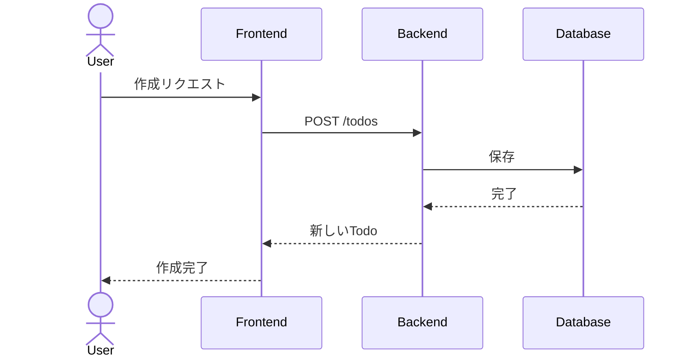
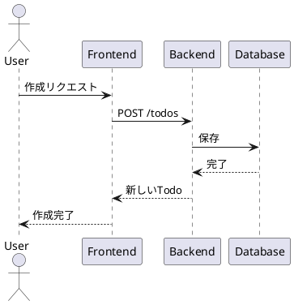

# **Slidev**の布教

所属会社 Tech meet up #1 登壇スライド

<div class="flex justify-center">
  
</div>

---
src: ../../components/slides/profile_2024.md
transition: slide-up
---

---

# **今日の話すこと**

1. 紹介背景
2. Slidevのについて
3. Slidevでできること
4. 簡単なデモをお見せします

---
layout: cover
---


<div class="flex justify-center flex-col text-center">
  <p v-click="1" class="text-2xl font-bold">エンジニアなら誰しも思うことがある</p>  

  <p v-click="2" class="text-2xl font-bold">コードを書くようにスライドを作りたい。</p>

  <p v-click="3" class="text-2xl font-bold">それでもGoogleスライドやCanvaを使っている。</p>

  <p v-click="4" class="text-2xl font-bold">でもMarkdownでスライドを作りたい。</p>

  <p v-click="5" class="text-2xl font-bold">それならもSlidevを使おうよ。</p>

  <p v-click="6" class="text-2xl font-bold">(個人差はあります。)</p>
</div>


---

# **目的**

  - プレゼンやLTを行う際、スライド作成に意外と時間がかかることってありませんか？  
  - GoogleスライドやCanvaを使っても、レイアウト調整が思ったより手間に感じませんか？
  - 開発者にとって馴染みのMarkdownを用いてスライドを作成できる。

## そんな時におすすめなのがこのToolです。

<div class="flex justify-center flex-col text-center">
  <div class="text-xl font-bold text-gray-900 p-4 rounded-lg shadow-lg bg-gradient-to-r from-gray-700 to-gray-300">
    <div class="text-3xl font-black text-red-700">
    「最近の推しのOSS」
    </div>
    <div class="text-3xl font-black">
      <a href="https://sli.dev/" target="_blank">Slidev</a> の布教
    </div> 
  </div>
</div>


<!-- 今回は、開発者向けのスライド作成に非常に便利なツール、Slidevを紹介します。-->

---

# **Slidevの概要**

- **Slidevとは何か？**  
  - 「Markdownでスライドを作成できるツール」  
  - 「HTMLとCSSを使える」  
  - 「Vueコンポーネントを組み込むことができるため、インタラクティブなスライドも作成可能」  
  - 「発表者用のプレゼンターモードの搭載」
  - 「プレゼンターと連携したスライドの視聴モードも存在」
  - 「一般公開された多様なテーマが利用でき、簡単にデザインを変更できる」

<div class="grid grid-cols-2 mt-12">
  <div>

  - **開発者紹介**:  
    - 「開発者はVue.jsのコアメンバー[Anthony Fu](https://github.com/antfu)さん」  
    - 「Nuxt、VueUse、Iconfy、その他Vue関連」

  </div>
  <div class="flex justify-center">
    
  </div>
</div>


---

# **Slidevの基本機能**

<ul>
  <li>
    <strong>スライド作成が簡単</strong>: 
    <ul>
      <li><strong>Markdownでスライド作成</strong>するため、コードを書くようにスライドを作成できます。</li>
      <li><strong>CSSでスタイリングが可能</strong>で、何度も位置調整する手間がなく、細かいデザインが可能です。<br>(cssなので人によるかもしれない。。。)</li>
    </ul>
  </li>
  <li><strong>プレゼンターモード</strong>:
    <ul>
      <li>発表者がスムーズに進行できるように、<strong>プレゼンターモード</strong>を提供しています。</li>
      <li>よくあるプレゼンターのみが参照するコメントも可能です。</li>
    </ul>
  </li>
  <li><strong>リアルタイムプレビューで作業効率UP</strong>:
    <ul>
    <li>リアルタイムプレビュー機能があり、スライドの編集を行いながら、その結果をすぐに確認できます。</li>
  </ul>
  </li>

  <li><strong>豊富なテーマとカスタマイズ性</strong>:
    <ul>
      <li><strong>公開されたテーマ</strong>を簡単に使用できます。テーマを選ぶだけで、デザイン性の高いスライドを作成できます。</li>
    </ul>
</li>
</ul>

<!--
なにしゃべろうかな。
休日ずっとSlack Appで遊んでたから
なんもすすんどらん  

カンニング用
text-red-500
bg-teel-500
hover:bg-teel-800
transition-all duration-300 
animate-ping

-->

---
layout: iframe
url: https://sli.dev/resources/theme-gallery#official-themes
---

---
layout: center
---

# slidevの基本機能のデモ


---
layout: two-cols-header
---

# **基本的な構文** header

::left::

# h1
## h2
### h3
#### h4
##### h5
###### h6

::right::


```markdown
# h1

## h2

### h3

#### h4

##### h5

###### h6
```

---
layout: two-cols-header
---

# **基本的な構文** リストや文字装飾

::left::

- リスト1
- リスト2
- リスト3

1. 番号リスト1
2. 番号リスト2
1. 番号リスト3

~~取り消し線~~

**太字**

*イタリック*

> 引用

[リンクテキスト](https://example.com)

::right::
```markdown

- リスト1
- リスト2
- リスト3

1. 番号リスト1
2. 番号リスト2
3. 番号リスト3

~~取り消し線~~

**太字**

*イタリック*

> 引用

[リンクテキスト](https://example.com)

```

---

# **基本的な構文** コードブロック

## 通常
```ts
// コードブロック
console.log('Hello, World!')
```

## monaco
```ts {monaco-run}
import { version } from 'vue'
import { emptyArray, sayHello } from './external'

sayHello()
console.log(`vue ${version}`)
console.log(emptyArray<number>(10).reduce(fib => [...fib, fib.at(-1)! + fib.at(-2)!], [1, 1]))
```

## コードのハイライト

```ts {2-3|5|all}
function add(
  a: Ref<number> | number,
  b: Ref<number> | number
) {
  return computed(() => unref(a) + unref(b))
}
```

---
layout: two-cols-header
---

# ページの **layout**

スライドを構成する要素を変更することができます。

::left::

|layout|説明|
|---|---|
|**center**|中央に配置する|
|**cover**|プレゼンテーションの表紙を表示する|
|**default**|デフォルトのレイアウト|
|**end**|プレゼンテーションの終了を示すために使用される|
|**fact**|事実を強調するために使用される|
|**full**|全画面にスライドを表示する|
|**image**|背景画像を設定する|


::right::

|layout|説明|
|---|---|
|**image-left**|左に画像を配置する
|**image-right**|右に画像を配置する|
|**iframe**|iframeを配置する|
|**quote**|引用を配置する|
|**statement**|ステートメントを配置する|
|**two-cols**|2列のスライドを配置する|
|**two-cols-header**|2列のヘッダーを配置する|

---
layout: center
---

# **layout** center

中央に配置することができます。

```markdown
---
layout: center
---
```

---
layout: cover
---

# **layout** cover

プレゼンテーションの表紙を表示するために使用され、プレゼンテーションのタイトルやコンテキストなどが含まれる。

```markdown
---
layout: cover
---
```

---
layout: default
---

# **layout** default

デフォルトのレイアウトです。

```markdown
---
layout: default
---
```

---
layout: end
---

# **layout** end

プレゼンテーションの終了を示すために使用される。

```markdown
---
layout: end
---
```

---
layout: fact
---

# **layout** fact

事実を強調するために使用される。

```markdown
---
layout: fact
---
```

---
layout: full
---

# **layout** full

全画面にスライドを表示する。

```markdown
---
layout: full
---
```

---
layout: image
image: https://cover.sli.dev
---

# **layout** image

スライドごとに背景画像を設定することができます。

<div class="grid grid-cols-2 mt-12">
  <div>

`このスライドは背景画像を設定しています。`

  </div>
  <div>

```markdown
---
layout: image
image: https://cover.sli.dev
---

```

  </div>
</div>


---
layout: image-left
image: https://cover.sli.dev
---

# **layout** image-left

右側に画像を配置しておしゃれにしてみましょう。

```markdown
---
layout: image-left
image: https://cover.sli.dev
---
```

---
layout: image-right
image: https://cover.sli.dev
---

# **layout** image-right

今度は左側に画像を配置しておしゃれにしてみましょう。

```markdown
---
layout: image-right
image: https://cover.sli.dev
---
```

---

# **layout** iframe

iframeを使って、WebPageをスライドとして表示することができます。

```markdown
---
layout: iframe
# the web page source
url: https://sli.dev/
---
```

次のスライドでは、iframeを使って、WebPageをスライドとして表示しています。

---
layout: iframe
# the web page source
url: https://sli.dev/
---

# iframe

---
layout: quote
---

# **layout** quote

引用を配置することができます。

```markdown
---
layout: quote
---
```


---
layout: section
---

# **layout** section

セクションを配置することができます。

```markdown
---
layout: section
---
```

---
layout: statement
---

# **layout** statement

ステートメントを配置することができます。

```markdown
---
layout: statement
---
```

---
layout: two-cols
---

# Left

左側に表示されます

# **layout** two-cols

::right::

# Right

右側に表示されます

```markdown
---
layout: two-cols
---
```


---
layout: two-cols-header
---

# **layout** two-cols-header

両方に表示されます

```markdown
---
layout: two-cols-header
---
```

::left::

# Left

左側に表示されます

::right::

# Right

右側に表示されます

---

# 数式の表示

KaTeXを搭載した LaTeX を使用して数式を表示することができます。
詳細は[Katex](https://katex.org)を参照してください。

<div class="grid grid-cols-2">
  <div>
    $\sqrt{3x-1}+(1+x)^2$
  </div>
  <div>

```
$\sqrt{3x-1}+(1+x)^2$
```

  </div>
</div>

<div class="grid grid-cols-2">
  <div>

$$
\begin{aligned}
\nabla \cdot \vec{E} &= \frac{\rho}{\varepsilon_0} \\
\nabla \cdot \vec{B} &= 0 \\
\nabla \times \vec{E} &= -\frac{\partial\vec{B}}{\partial t} \\
\nabla \times \vec{B} &= \mu_0\vec{J} + \mu_0\varepsilon_0\frac{\partial\vec{E}}{\partial t}
\end{aligned}
$$

  </div>
  <div>

```markdown
$$
\begin{aligned}
\nabla \cdot \vec{E} &= \frac{\rho}{\varepsilon_0} \\
\nabla \cdot \vec{B} &= 0 \\
\nabla \times \vec{E} &= -\frac{\partial\vec{B}}{\partial t} \\
\nabla \times \vec{B} &= \mu_0\vec{J} + \mu_0\varepsilon_0\frac{\partial\vec{E}}{\partial t}
\end{aligned}
$$

```

  </div>
</div>


---
layout: two-cols-header
---


# **図表やグラフ**

Mermaid.jsやPlantUMLを使ってグラフや図表を描画できます。

::left::

## Mermaid


::right::

## PlantUML


---

# スライドのインポート

スライドのインポートも簡単にできます。

```
---
src: ../../components/slides/profile_2024.md
---
```

---

# Styleを変更する

WindiCSS(tailwindCSS互換)を使用して、styleを指定することができます。

<div class="grid grid-cols-2 gap-4">

  <div class="bg-gradient-to-r from-teal-300 via-teal-500 to-yellow-500 text-white p-4 rounded-lg shadow-lg animate-pulse">
    <h1 class="text-2xl font-bold animate-none">Hello, World!</h1>
    <p class="text-base animate-none">This is a custom css.</p>
  </div>

```markdown
  <div class="bg-gradient-to-r from-teal-300 via-teal-500 to-yellow-500 text-white p-4 rounded-lg shadow-lg animate-pulse">
    <h1 class="text-2xl font-bold">Hello, World!</h1>
    <p class="text-base">This is a custom component.</p>
  </div>
```

</div>


---
foo: bar
dragPos:
  square: 361,37,162,_,-14
---

# Draggable Elements

ドラッグ可能な要素をダブルクリックして位置を編集できます。

<br>

###### Directive Usage

```md

```

<br>

###### Component Usage

```md
<v-drag text-3xl>
  <carbon:arrow-up />
  Use the `v-drag` component to have a draggable container!
</v-drag>
```

<v-drag pos="367,163,261,_,-15"undefinedundefinedundefinedundefinedundefinedundefinedundefinedundefinedundefinedundefinedundefinedundefinedundefinedundefinedundefinedundefinedundefinedundefinedundefinedundefinedundefinedundefinedundefinedundefinedundefinedundefinedundefinedundefinedundefinedundefinedundefinedundefinedundefinedundefinedundefinedundefinedundefinedundefinedundefinedundefinedundefinedundefinedundefinedundefinedundefinedundefinedundefinedundefinedundefinedundefinedundefinedundefinedundefinedundefinedundefinedundefinedundefinedundefinedundefinedundefinedundefinedundefinedundefinedundefinedundefinedundefinedundefinedundefinedundefinedundefinedundefinedundefinedundefinedundefinedundefinedundefinedundefinedundefinedundefinedundefinedundefinedundefinedundefinedundefinedundefinedundefinedundefinedundefinedundefinedundefinedundefinedundefinedundefinedundefinedundefinedundefinedundefinedundefinedundefinedundefinedundefinedundefinedundefinedundefinedundefinedundefinedundefinedundefinedundefined>
  <div text-center text-3xl border border-main rounded>
    ダブルクリック!
  </div>
</v-drag>


###### Draggable Arrow

```md
<v-drag-arrow two-way />
```

<v-drag-arrow pos="70,430,253,46" two-way op70 />

---

# トランジションやアニメーション

トランジションやアニメーションも簡単に追加できます。

|transition|説明|
|---|---|
|fade | クロスフェード|
|fade-out | フェードアウトしてからフェードイン|
|slide-left | 左にスライド|
|slide-right | 右にスライド|
|slide-up | 上にスライド|
|slide-down | 下にスライド|
|view-transition | ビュートランジションAPIを使用|

---
transition: fade
---

# トランジション fade
```markdown
---
transition: fade
---
```
---
transition: fade-out
---

# トランジション fade-out
```markdown
---
transition: fade-out
---
```

---
transition: slide-left
---

# トランジション slide-left
```markdown
---
transition: slide-left
---
```

---
transition: slide-right
---

# トランジション slide-right

```markdown
---
transition: slide-right
---
```

---
transition: slide-up
---


# トランジション slide-up

```markdown
---
transition: slide-up
---
```

---
transition: slide-down
---

# トランジション slide-down

```markdown
---
transition: slide-down
---
```

---
transition: view-transition
---

# トランジション view-transition

```markdown
---
transition: view-transition
---
```

# View Transition {.inline-block.view-transition-title}

---

# View Transition {.inline-block.view-transition-title}

---

# Motions

 **motion** は[@vueuse/motion](https://motion.vueuse.org/)で提供されています。

```html
<div
  v-motion
  :initial="{ x: -80 }"
  :enter="{ x: 0 }"
  :click-3="{ x: 80 }"
  :leave="{ x: 1000 }"
>
  Slidev
</div>
```

<div class="w-60 relative">
  <div class="relative w-40 h-40">
    
    
    
  </div>

  <div
    class="text-5xl absolute top-14 left-40 text-[#2B90B6] -z-1"
    v-motion
    :initial="{ x: -80, opacity: 0}"
    :enter="{ x: 0, opacity: 1, transition: { delay: 2000, duration: 1000 } }">
    Slidev
  </div>
</div>

<!-- vue script setup scripts can be directly used in markdown, and will only affects current page -->
<script setup lang="ts">
const final = {
  x: 0,
  y: 0,
  rotate: 0,
  scale: 1,
  transition: {
    type: 'spring',
    damping: 10,
    stiffness: 20,
    mass: 2
  }
}
</script>

<div
  v-motion
  :initial="{ x:35, y: 30, opacity: 0}"
  :enter="{ y: 0, opacity: 1, transition: { delay: 3500 } }">

[Learn More](https://sli.dev/guide/animations.html#motion)

</div>

---


# Components

<div grid="~ cols-2 gap-4">
<div>

Vue componentsをスライド内で直接使用することができます。

いくつかの組み込みコンポーネントを提供しています。

```html
<Counter :count="10" />
```

<!-- ./components/Counter.vue -->
<Counter :count="10" m="t-4" />


</div>
<div>

```html
<Tweet id="1799731407054610654" />
```

<Tweet id="1799731407054610654" scale="0.5" />

</div>
</div>

---

# 最後に
[]


Slidevを使うことで、スライド作成が楽しくなります。<br>
コードを書くようにスライドを作成できるので、開発者にとって非常に親しみやすいです。<br>
デザインの自由度も高く、スライド作成がより楽しくなります。<br>


<div class="grid grid-cols-2 mt-12">
  <div>

  <p>こちらのリポジトリを参考にして<br>
  ぜひSlidevを試してみてください。</p>

  <a href="https://github.com/SphereStacking/SlideCollection">SphereStacking/SlideCollection</a>

  </div>
  <div class="flex justify-center">
    
  </div>
</div>

複数のスライドを同じリポジトリで管理し、GitHub ActionsでGitHub Pagesにデプロイするように設定されています。ForkまたはCloneして試してみてください。（良かったらStarもお願いします！）

---
layout: end
---

# ご清聴ありがとうございました。
